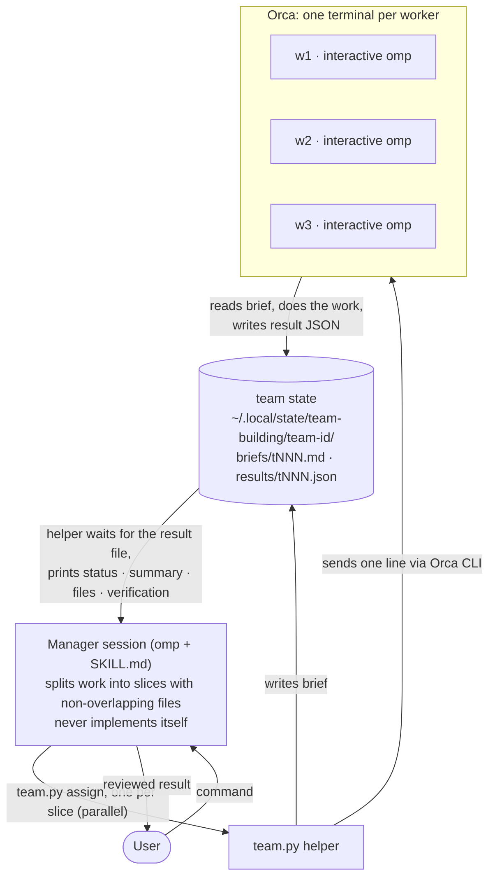

# team-building

An [omp](https://github.com/can1357/oh-my-pi) skill: the current session becomes a manager that splits each user
command into slices and hands them to persistent worker sessions (w1, w2, …). Each worker is an interactive `omp` in
its own [Orca](https://github.com/stablyai/orca) terminal and always returns a result JSON. Usage and rules:
[`SKILL.md`](SKILL.md).

## Concept



- Workers are persistent: each keeps its own omp session, so a follow-up to `wN` has the earlier context.
- Every assignment returns `succeeded`, `failed` or `blocked`, including on timeout, a crash or a bad model. Workers
  never ask the user; they report `blocked` with the exact need.
- `team clear` collects a wrap-up from every worker, closes their terminals and writes one summary report.

## Requirements

- `omp` on `PATH` (tested with omp 18.3.2), with `tools.approvalMode` set to `yolo` — nobody can answer approval
  prompts inside a worker tab, so `init` refuses otherwise:
  `omp config set tools.approvalMode yolo`
- Orca running, its CLI on `PATH` as `orca-ide` (tested with 1.4.197). Different name → `export ORCA_CLI_COMMAND=<cli>`.
  Never point it at bare `orca` on Linux (GNOME screen reader).
- Python 3 (stdlib only).

## Install

`SKILL.md` calls the helper at `~/.agents/skills/team-building/team.py`, so clone to exactly that path
(omp loads skills from `~/.agents/skills`):

```sh
git clone https://github.com/DamChan0/team-building-skill ~/.agents/skills/team-building
python3 ~/.agents/skills/team-building/team.py status   # fresh install: "no active team; run `team.py init` first"
```

Restart omp, then say `team init` (or `팀 만들어줘, 작업자 4명`).

Update: `git -C ~/.agents/skills/team-building pull`
Uninstall: run `team clear` first, then `rm -rf ~/.agents/skills/team-building`

## Files written at runtime

- `~/.local/state/team-building/<team-id>/` — team state, briefs, results, worker sessions (deleted by `clear`)
- `~/work-notes/team-building/<date>-<team-id>.md` — wrap-up report written by `clear`
