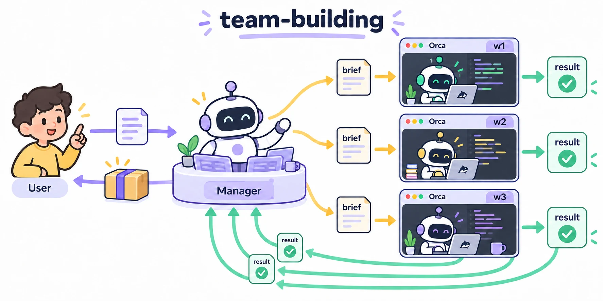
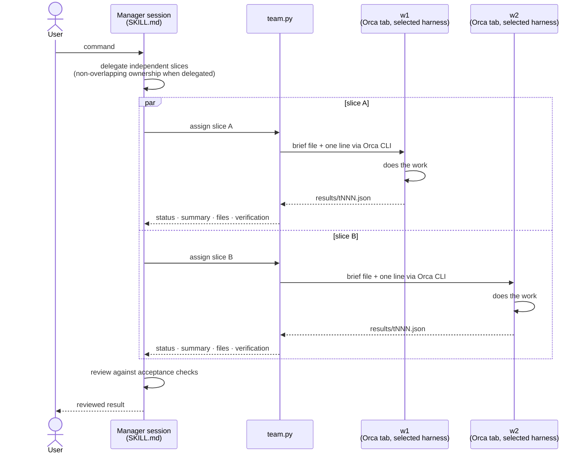

# team-building



Persistent AI-worker teams: the current session becomes a manager that splits work into slices and hands them to
persistent worker sessions (w1, w2, …). Each worker runs omp, Claude Code, or Codex in its own
[Orca](https://github.com/stablyai/orca) terminal and returns a result JSON. Usage and rules: [`SKILL.md`](SKILL.md).

## Concept



- Workers are persistent: each keeps its own harness session, so a follow-up to `wN` has earlier context.
- Every assignment returns `succeeded`, `failed` or `blocked`, including on timeout, a crash or a bad model.
  Workers never ask the user; they report `blocked` with the exact need.
- `team clear` collects a wrap-up from every worker, closes their terminals and writes one summary report.

- Shared cwd is the default. `team init --isolate` gives each worker an Orca worktree and requires a local commit for manager review/merge; each worktree has separate build caches (for example `target/` or `node_modules`), so cold builds and disk use increase.
- Assignments use an idle timeout (default 1200 seconds) and absolute cap (default 14400 seconds). External commands are blocked pending an exact per-task approval.

## Requirements

- Python 3 (stdlib only) and Orca running, its CLI on `PATH` as `orca-ide` (tested with 1.4.197). Different name →
  `export ORCA_CLI_COMMAND=<cli>`. Never point it at bare `orca` on Linux (GNOME screen reader).
- Worker harnesses on `PATH`: omp 18.3.2 (requires `tools.approvalMode=yolo`), Claude Code 2.1.283, or Codex CLI
  0.157.1. Claude Code and Codex require explicit `--allow-bypass`, enabling their documented permission-bypass flag.

## Install

Clone to `~/.agents/skills/team-building`; omp and Codex load this skills directory:

```sh
git clone https://github.com/DamChan0/team-building-skill ~/.agents/skills/team-building
python3 ~/.agents/skills/team-building/team.py status   # fresh install: "no active team; run `team.py init` first"
```

Claude Code loads user skills from `~/.claude/skills`; point it at the same checkout:

```sh
mkdir -p ~/.claude/skills
ln -s ~/.agents/skills/team-building ~/.claude/skills/team-building
```

Restart the manager harness, then say `team init` (or `팀 만들어줘, 작업자 4명`). Use
`team init --harness claude --allow-bypass` or `--harness codex --allow-bypass` for those worker harnesses.

Update: `git -C ~/.agents/skills/team-building pull`
Uninstall: run `team clear` first, then `rm -rf ~/.agents/skills/team-building`

## Files written at runtime

- `~/.local/state/team-building/<team-id>/` — team state, briefs, results, worker sessions (deleted by `clear`)
- `~/work-notes/team-building/<date>-<team-id>.md` — wrap-up report written by `clear`
